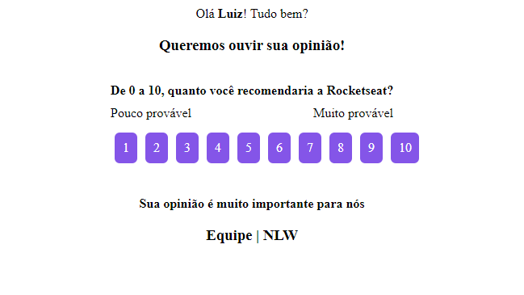

# NPS - Net Promoter Score

<h2 align="center">
  
</h2>

  

  
  

  

  

  

## 💻 Projeto

Aplicação feita em [Node.js] no [NLW]4.
Net Promoter Score é uma métrica desenvolvida para medir os níveis de lealdade do cliente. O Score varia de -100 até 100.

Ele ele obtido através de pesquisas de satisfação: "Em uma escala de 0 a 10, qual a probabilidade de você recomendar nossa empresa / produto / serviço".

Os clientes podem ser divididos em 3 grupos:

- Promotores (pontuação 9-10)
- Neutros (pontuação 7-8)
- Detratores (pontuação 0-6)

O calculo: NPS = (Promotores - Detratores) / Total de respostas \* 100

### 📧 E-mail

<h1 align="center">
    
</h1>

## 🚀 Tecnologias

Esse projeto foi desenvolvido com as seguintes tecnologias:

- [Node.js](https://nodejs.org)

[node.js]: https://nodejs.org/
[nlw]: https://nextlevelweek.com/
